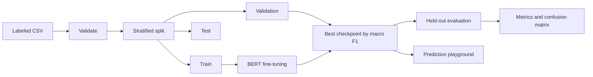
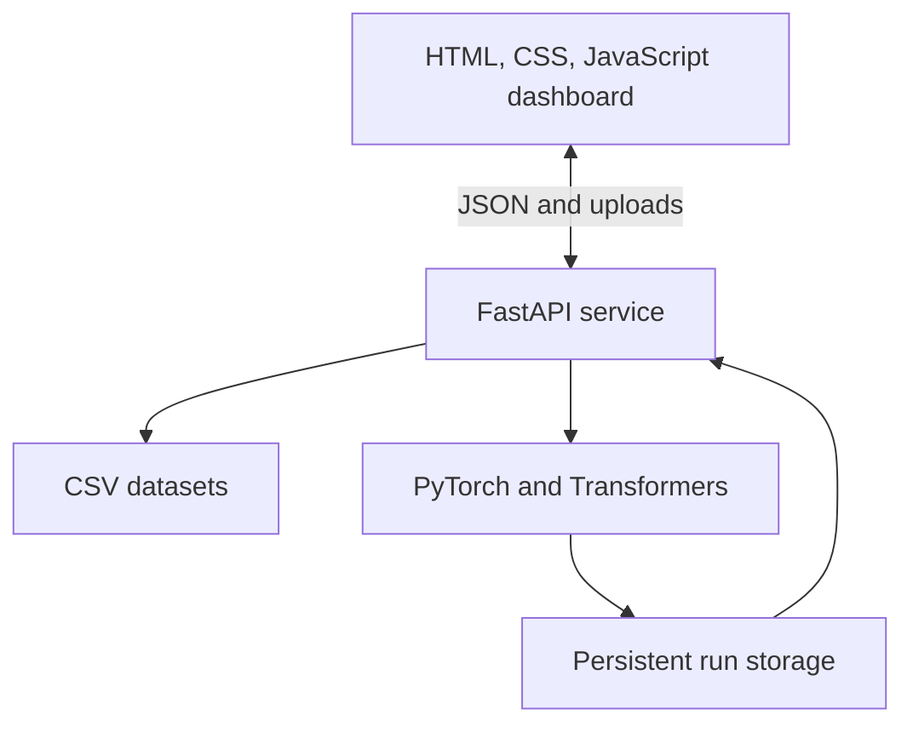

# Transformer Lab

<p align="center"><strong>An end-to-end BERT fine-tuning, evaluation, and inference workspace.</strong></p>

<p align="center">
  
  
  
  
  
</p>

Transformer Lab is a complete supervised text-classification project built with **Python, PyTorch, Hugging Face Transformers, BERT, and FastAPI**. It provides a polished browser workspace and a command-line interface for preparing labeled data, fine-tuning a Transformer, tracking experiments, evaluating model quality, exporting metrics, and running predictions.

Training selects the checkpoint with the highest validation macro F1 score and evaluates it once on a held-out test set. This separates model selection from final evaluation and produces reusable model artifacts for the web app and CLI.

## Contents

- [Features](#features)
- [Architecture](#architecture)
- [Project structure](#project-structure)
- [Quick start](#quick-start)
- [Dataset format](#dataset-format)
- [Web application](#web-application)
- [Command-line workflow](#command-line-workflow)
- [Outputs and metrics](#outputs-and-metrics)
- [API reference](#api-reference)
- [Configuration](#configuration)
- [Testing](#testing)
- [Deployment](#deployment)
- [Security and operations](#security-and-operations)
- [Troubleshooting](#troubleshooting)

## Features

- Upload and validate UTF-8 CSV datasets.
- Inspect label distribution and sample records before training.
- Create reproducible stratified train, validation, and test splits.
- Fine-tune `google-bert/bert-base-uncased` with PyTorch.
- Run a tiny random BERT checkpoint for quick workflow checks.
- Track queued, running, completed, and failed experiments.
- Select the best checkpoint using validation macro F1.
- Calculate accuracy, macro and weighted precision, recall, and F1.
- Display per-class metrics, support counts, and a confusion matrix.
- Export experiment metrics as JSON.
- Classify new text with a saved model.
- Use the complete workflow through a Python CLI.
- Protect hosted API routes with a bearer access key.
- Build the frontend for Vercel and run the backend in Docker.

## Architecture



The browser communicates with a FastAPI service. Training runs in a background thread, while datasets, checkpoints, histories, and metrics are written to persistent storage.



## Project structure

```text
Transformer/
|-- examples/
|   `-- sentiment.csv            # Small practice dataset
|-- scripts/
|   |-- build-vercel.mjs         # Builds the static Vercel frontend
|   `-- smoke_web.py             # End-to-end training and API check
|-- tests/
|   |-- test_data_metrics.py     # Data split and metric tests
|   `-- test_web_app.py          # API, upload, auth, and validation tests
|-- text_classifier/
|   |-- __main__.py              # Enables python -m text_classifier
|   |-- cli.py                   # CLI commands
|   |-- data.py                  # CSV loading, validation, and splitting
|   |-- metrics.py               # Classification metrics
|   `-- workflow.py              # Training, evaluation, and inference
|-- web_app/
|   |-- server.py                # FastAPI routes and run manager
|   `-- static/
|       |-- index.html           # Dashboard views
|       |-- styles.css           # Responsive interface styling
|       |-- app.js               # Client state and API integration
|       |-- config.js            # Local API URL configuration
|       `-- favicon.svg
|-- Dockerfile                   # Production backend container
|-- package.json                 # Frontend build command
|-- requirements.txt             # Pinned Python dependencies
`-- vercel.json                  # Vercel configuration
```

Generated directories are excluded from Git:

- `web_data/` — uploads, web runs, saved models, and metrics.
- `outputs/` — model artifacts created through the CLI.
- `dist/` — generated Vercel frontend.
- `.venv/` — local Python environment.

## Quick start

### Prerequisites

- Python 3.11 or newer; tested with Python 3.12.
- Node.js only for the Vercel frontend build.
- Internet access for the first model download.
- Sufficient CPU or GPU memory for the selected checkpoint.

### 1. Clone the project

```bash
git clone https://github.com/addagirigopikaspurthi/Transformer.git
cd Transformer
```

### 2. Install dependencies

Windows PowerShell:

```powershell
python -m venv .venv
.venv\Scripts\Activate.ps1
python -m pip install --upgrade pip
python -m pip install -r requirements.txt
```

macOS or Linux:

```bash
python3 -m venv .venv
source .venv/bin/activate
python -m pip install --upgrade pip
python -m pip install -r requirements.txt
```

For CUDA, choose the correct PyTorch installation from the [official guide](https://pytorch.org/get-started/locally/) before installing the remaining packages.

### 3. Run the application

```bash
python -m uvicorn web_app.server:app --host 127.0.0.1 --port 8765
```

Open [http://127.0.0.1:8765](http://127.0.0.1:8765).

## Dataset format

Use a UTF-8 CSV containing `text` and `label` columns:

```csv
text,label
"The service was excellent",positive
"Delivery was late",negative
"The interface is simple to use",positive
```

Requirements:

- Column names must be exactly `text` and `label`.
- Text and label values cannot be empty.
- At least two distinct labels are required.
- Each label needs at least three examples for stratified splitting.
- Browser uploads are limited to 10 MB.
- Labels may be words, numbers, or any value representable as text.

The automatic splitter preserves label proportions. It cannot detect related samples such as messages from the same author, so group those records manually when leakage matters.

The bundled sample is for demonstrating the workflow. Its scores do not represent real-world performance.

## Web application

The dashboard has five connected areas:

1. **Overview** — dataset counts, experiment states, completed models, and best test F1.
2. **Datasets** — CSV upload, sample inspection, and label distribution.
3. **Training** — dataset and checkpoint selection, hyperparameters, and live progress.
4. **Evaluation** — accuracy, precision, recall, F1, class metrics, history, and confusion matrix.
5. **Playground** — live classification using a completed model.

Choose **BERT base uncased** for a meaningful experiment. Choose **Tiny random BERT** only to verify that loading, training, saving, evaluation, and inference work end to end.

## Command-line workflow

### Split a dataset

```bash
python -m text_classifier split \
  --input data/all.csv \
  --output-dir data/splits \
  --test-fraction 0.15 \
  --validation-fraction 0.15 \
  --seed 42
```

### Train

```bash
python -m text_classifier train \
  --train data/splits/train.csv \
  --validation data/splits/validation.csv \
  --test data/splits/test.csv \
  --output-dir outputs/experiment-1 \
  --model-name google-bert/bert-base-uncased \
  --epochs 3 \
  --batch-size 16 \
  --max-length 256 \
  --learning-rate 0.00002 \
  --device auto
```

On Windows PowerShell, put the command on one line or replace each trailing `\` with a backtick.

### Evaluate and predict

```bash
python -m text_classifier evaluate \
  --model-dir outputs/experiment-1 \
  --data data/splits/test.csv

python -m text_classifier predict \
  --model-dir outputs/experiment-1 \
  --text "The service was excellent"
```

Run `python -m text_classifier --help`, or append `--help` to a subcommand, to see every option.

## Outputs and metrics

A successful run saves a Hugging Face model and tokenizer with:

```text
model-directory/
|-- config.json
|-- model.safetensors
|-- tokenizer.json
|-- tokenizer_config.json
|-- vocab.txt
|-- labels.json                 # Ordered class names
|-- history.json                # Loss and validation metrics by epoch
`-- metrics.json                # Best epoch and final evaluation
```

Evaluation includes accuracy; macro and weighted precision, recall, and F1; per-class metrics and support; the confusion matrix; and the best validation epoch. Macro F1 is the model-selection metric because it gives each class equal importance.

## API reference

| Method | Route | Purpose |
|---|---|---|
| `GET` | `/health` | Service health check |
| `GET` | `/api/overview` | List datasets and runs |
| `POST` | `/api/datasets` | Upload and validate a CSV |
| `POST` | `/api/runs` | Start a background training run |
| `GET` | `/api/runs/{run_id}` | Read run progress and results |
| `GET` | `/api/runs/{run_id}/metrics` | Download metrics JSON |
| `POST` | `/api/runs/{run_id}/predict` | Classify text with a completed run |

Interactive FastAPI documentation is available at `/docs` while the service is running.

Example training request:

```json
{
  "dataset_id": "sample",
  "model_name": "google-bert/bert-base-uncased",
  "epochs": 3,
  "batch_size": 16,
  "max_length": 256,
  "learning_rate": 0.00002,
  "device": "auto"
}
```

## Configuration

| Variable | Required | Description |
|---|---:|---|
| `TRANSFORMER_STORAGE_DIR` | No | Storage directory; defaults to `web_data/` |
| `TRANSFORMER_API_KEY` | Hosted deployments | Bearer key for `/api/*` routes |
| `TRANSFORMER_REQUIRE_API_KEY` | Production container | Set to `1` to reject startup without a key |
| `TRANSFORMER_ALLOWED_ORIGINS` | Separate frontend | Comma-separated exact origins allowed by CORS |
| `PUBLIC_API_URL` | Vercel build | Public HTTPS origin of the Python backend |
| `PORT` | Hosting platform | Listening port; container default is `8765` |

Never expose `TRANSFORMER_API_KEY` in a frontend variable. The browser asks for it at runtime and keeps it in session storage.

## Testing

Run the automated suite:

```bash
python -m unittest discover -s tests -v
```

The tests cover CSV validation, reproducible splitting, metrics, uploads, request validation, and API-key protection.

Run the optional end-to-end smoke check:

```bash
python -m scripts.smoke_web
```

It trains tiny random BERT on the sample, waits for completion, reads test metrics, and verifies prediction.

Validate the Vercel build locally:

```bash
node scripts/build-vercel.mjs http://127.0.0.1:8765
```

## Deployment

### Backend container

Training and saved models need a continuously running service with persistent storage. Build and run the CPU image:

```bash
docker build -t transformer-lab .
docker run --rm -p 8765:8765 \
  -e TRANSFORMER_API_KEY=replace-with-a-long-random-key \
  -e TRANSFORMER_ALLOWED_ORIGINS=https://your-site.vercel.app \
  -v transformer-data:/data \
  transformer-lab
```

Attach a volume at `/data`. Use one backend instance because the current training queue is held in process memory.

### Frontend on Vercel

1. Deploy the backend container with adequate compute and persistent storage.
2. Give it a public HTTPS URL.
3. Configure `TRANSFORMER_API_KEY` and `TRANSFORMER_ALLOWED_ORIGINS`.
4. Import this repository into Vercel using the **Other** framework preset.
5. Set `PUBLIC_API_URL` to the backend origin, such as `https://api.example.com`.
6. Deploy. Vercel runs `npm run build` and serves `dist/`.

The build rejects localhost on Vercel and rejects URLs with credentials, paths, query strings, or fragments.

## Security and operations

- The production container refuses to start without an API key.
- API keys use a timing-safe comparison.
- Uploads must be CSV and are limited to 10 MB.
- Hosted frontends should use exact CORS origins.
- Do not commit `web_data/`, trained models, uploaded data, or secrets.
- Only one training run may be active at a time.
- Interrupted runs are marked failed after a server restart.
- Use one server process until job state is moved to a shared queue and database.

## Troubleshooting

### The first run is slow

The model and tokenizer download from Hugging Face on first use. BERT base is expensive on CPU; use a CUDA-enabled PyTorch build when possible.

### A dataset cannot be split

Add more examples for each label or adjust the split fractions. Small and imbalanced datasets may need more than the minimum three examples per label.

### CUDA is unavailable

Use `--device cpu`, or install the PyTorch build matching your GPU driver and CUDA version.

### The hosted frontend cannot reach the backend

Confirm that `PUBLIC_API_URL` is the backend HTTPS origin, `TRANSFORMER_ALLOWED_ORIGINS` exactly matches the frontend origin, and `/health` is publicly reachable.

### The browser asks for an access key

Enter the value configured as `TRANSFORMER_API_KEY`. It stays in browser session storage and is cleared when the session ends.

---

Built as a practical demonstration of Transformer fine-tuning, supervised text classification, reproducible evaluation, and deployable ML application design.
